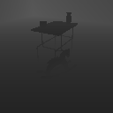
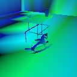

# `frame_data.py`

## `FrameData`

`from tdw.sticky_mitten_avatar.frame_data import FrameData`

Per-frame data that an avatar can use to decide what action to do next.

Access this data from the [StickyMittenAvatarController](sma_controller.md):

```python
from sticky_mitten_avatar import StickyMittenAvatarController, Arm

c = StickyMittenAvatarController()
c.init_scene()

# Look towards the left arm.
c.rotate_camera_by(pitch=70, yaw=-45)

c.reach_for_target(target={"x": -0.2, "y": 0.21, "z": 0.385}, arm=Arm.left)

# Save the image.
c.frame.save_images(output_directory="dist")
c.end()
```

***

## Fields

### Visual

- `image_pass` Rendered image of the scene as a numpy array.

 

- `id_pass` Image pass of object color segmentation as a numpy array. If `id_pass == False` in the `StickyMittenAvatarController` constructor, this will be None.

 

- `depth_pass` Image pass of depth values per pixel as a numpy array. Use the camera matrices to interpret this data.
   If the `grayscale_depth` of the `StickyMittenAvatarController` is True: The shader used to calculate the depth pass is the [same as the one used in AI2-Thor](https://github.com/allenai/ai2thor/blob/master/unity/Assets/ImageSynthesis/Shaders/DepthBW.shader).

 

 If the `grayscale_depth` of the `StickyMittenAvatarController` is False: The depth pass is an RGB image with more precise data:

 

- `projection_matrix` The [camera projection matrix](https://github.com/threedworld-mit/tdw/blob/master/Documentation/api/output_data.md#cameramatrices) of the avatar's camera as a numpy array.
- `camera_matrix` The [camera matrix](https://github.com/threedworld-mit/tdw/blob/master/Documentation/api/output_data.md#cameramatrices) of the avatar's camera as a numpy array.

### Audio

- `audio` A list of tuples of audio generated by impacts. The first element in the tuple is a [`Base64Sound` object](https://github.com/threedworld-mit/tdw/blob/master/Documentation/python/py_impact.md#base64sound).
          The second element is the ID of the "target" (smaller) object.
          If the `audio` parameter of the `StickyMittenAvatar` constructor is False, this will be empty.

```python
for audio in c.frame.audio:
    # Get the audio data.
    wav_data = audio[0].bytes
    # Get the position of the object that generated the audio data.
    object_id = audio[1]
    position = c.frame.object_transforms[object_id].position
```

### Objects

- `object_transforms` The dictionary of object [transform data](transform.md). Key = the object ID.

```python
for object_id in c.frame.object_transforms:
    print(c.frame.object_transforms[object_id].position)
```

### Avatar

- `avatar_transform` The [transform data](transform.md) of the avatar.

```python
avatar_position = c.frame.avatar_transform.position
```

- `avatar_body_part_transforms` The [transform data](transform.md) of each body part of the avatar. Key = body part ID.

```python
# Get the position and segmentation color of each body part.
for body_part_id in c.frame.avatar_body_part_transforms:
    position = c.frame.avatar_body_part_transforms[body_part_id]
    segmentation_color = c.static_avatar_data[body_part_id]
```

- `held_objects` A dictionary of IDs of objects held in each mitten. Key = arm:

```python
from sticky_mitten_avatar import StickyMittenAvatarController, Arm

c = StickyMittenAvatarController()

# Your code here.

# Prints all objects held by the left mitten at the last frame.
print(c.frame.held_objects[Arm.left])
```

***

## Functions

***

#### \_\_init\_\_

**`def __init__(self, resp: List[bytes], objects: Dict[int, StaticObjectInfo], avatar: Avatar, audio: bool)`**


| Parameter | Description |
| --- | --- |
| resp | The response from the build. |
| objects | Static object info per object. Key = the ID of the object in the scene. |
| avatar | The avatar in the scene. |
| audio | If true, record audio. |

***

#### set_surface_material

**`def set_surface_material(surface_material: AudioMaterial) -> None`**

_This is a static function._

Set the surface material of the scene.

| Parameter | Description |
| --- | --- |
| surface_material | The floor's [audio material](https://github.com/threedworld-mit/tdw/blob/master/Documentation/python/py_impact.md#audiomaterialenum). |

***

#### save_images

**`def save_images(self, output_directory: Union[str, Path]) -> None`**

Save the ID pass (segmentation colors) and the depth pass to disk.
Images will be named: `[frame_number]_[pass_name].[extension]`
For example, the depth pass on the first frame will be named: `00000000_depth.png`
The image pass is a jpg file and the other passes are png files.

| Parameter | Description |
| --- | --- |
| output_directory | The directory that the images will be saved to. |

***

#### get_pil_images

**`def get_pil_images(self) -> dict`**

Convert each image pass to PIL images.

_Returns:_  A dictionary of PIL images. Key = the name of the pass (img, id, depth)

***

#### get_depth_values

**`def get_depth_values(self) -> np.array`**

_Returns:_  A decoded depth pass as a numpy array of floats.

***

