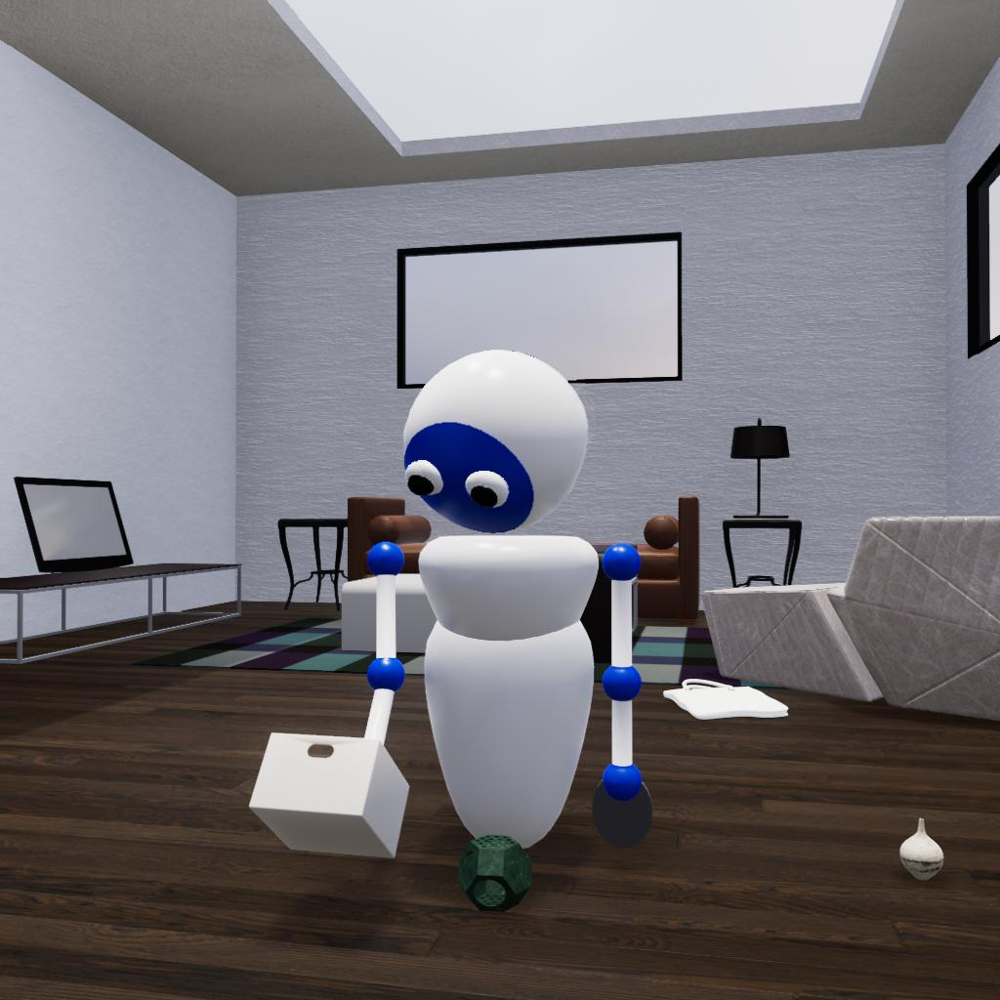

# Sticky Mitten Avatar API

A high-level API for [TDW's](https://github.com/threedworld-mit/tdw/) [Sticky Mitten Avatar](https://github.com/threedworld-mit/tdw/blob/master/Documentation/misc_frontend/sticky_mitten_avatar.md). Try to gather objects and put them at a target goal area as fast as possible!



- Generate indoor environments with realistic rigidbody physics and visual rendering that are populated by objects. Some objects are procedurally placed, others are not.
- Use the Sticky Mitten Avatar to interact with objects. The Sticky Mitten Avatar is driven entirely by physics in a robotics-esque fashion. Its mittens can attach to objects in the scene. This API adds high-level functionality to the Sticky Mitten Avatar, such as a physics-driven IK system.
- The Sticky Mitten Avatar can place objects in containers and then pick up the container to efficiently gather objects in the scene.

## Installation

1. [Install TDW](https://github.com/threedworld-mit/tdw/). Make sure you are using the latest version.
2. Clone this repo.
3. `cd path/to/sticky_mitten_avatar` (replace `path/to` with the actual path).
4. Install the local `sticky_mitten_avatar` pip module:

| Windows                    | OS X and Linux      |
| -------------------------- | ------------------- |
| `pip3 install -e . --user` | `pip3 install -e .` |

## Usage

```python
from sticky_mitten_avatar import StickyMittenAvatarController, Arm

c = StickyMittenAvatarController()
c.init_scene() # Creates an empty room. See API documentation for how to load a furnished scene.
task_status = c.reach_for_target(arm=Arm.left, target={"x": 0.1, "y": 0.6, "z": 0.4})
print(task_status) # TaskStatus.success
c.end()
```

### API

**[Read this document.](Documentation/sma_controller.md)** 

- At the start of the simulation, the controller caches [static object info](Documentation/static_object_info.md) per object in the scene and [static avatar info](Documentation/body_part_static.md).
- Each API function returns a [TaskStatus](Documentation/task_status.md) indicating whether the action succeeded and if not, why.
- After calling each function, the controller updates its [FrameData](Documentation/frame_data.md). This data can be used to decide what the avatar's next action will be (pick up an object, navigate around a room, etc.)
- Most complex tasks, such as navigation/pathfinding are not implemented in this API because the problem is too unbounded for a simple algorithm. However, given the output data (static object info, static avatar info, and FrameData), an agent equipped with ML data can be trained to do any of these tasks successfully.

### API (low-level)

- For more information regarding TDW, see the [TDW repo](https://github.com/threedworld-mit/tdw/).
- For more information regarding TDW's low-level Sticky Mitten Avatar API, [read this](https://github.com/threedworld-mit/tdw/blob/master/Documentation/misc_frontend/sticky_mitten_avatar.md).

## How to write your controller

You can write your controller like this:

```python
from sticky_mitten_avatar import StickyMittenAvatarController, Arm

c = StickyMittenAvatarController()
c.init_scene()
task_status = c.reach_for_target(arm=Arm.left, target={"x": 0.1, "y": 0.6, "z": 0.4})
print(task_status) # TaskStatus.success
c.end()
```

...or this, with your own class:

```python
from sticky_mitten_avatar import StickyMittenAvatarController, Arm

class MyController(StickyMittenAvatarController):
    def my_function(self):
        return self.reach_for_target(arm=Arm.left, target={"x": 0.1, "y": 0.6, "z": 0.4})

if __name__ == "__main__":
    c = MyController()
    c.init_scene()
    print(c.my_function()) # TaskStatus.success
    c.end()
```

To do something per-frame, regardless of whether the avatar is in the middle of an action, override the `communicate()` function. See [this controller](https://github.com/alters-mit/sticky_mitten_avatar/blob/master/controllers/put_object_in_container.py), which overrides `communicate()` in order to save an image every frame.

## Examples

All example controllers can be found in: `controllers/`

| Controller            | Description                                            |
| --------------------- | ------------------------------------------------------ |
| `fill_container.py`   | Fill a container with objects.                         |
| `social_image.py`     | Generate the social image for the GitHub preview card. |
| `initialize_scene.py` | Initialize a floorplan populated with objects.         |

## Tests

| Controller                 | Description                                                  |
| -------------------------- | ------------------------------------------------------------ |
| `ik_test.py`               | Test the IK chains of the avatar's arms.                     |
| `collision_test.py`        | Test the avatar's response to collisions.                    |
| `turn_test.py`             | Test avatar turning.                                         |
| `composite_object_test.py` | Test if the avatar can grasp a sub-object of a composite object. |
| `mitten_collision_test.py` | Test mitten collision detection.                             |
| `precision_test.py`        | Test how the `precision` parameter affects arm articulation. |
| `proc_gen_spawn_test.py`   | Test whether target objects and containers tend to stay in their initial positions. |
| `target_object_test.py`    | Test target objects.                                         |

## Utility scripts

Utility scripts are located in `util/`

| Script                      | Description                                                  |
| --------------------------- | ------------------------------------------------------------ |
| `composite_object_audio.py` | Get default audio parameters for sub-objects of composite objects. |
| `occupancy_mapper.py` | Create occupancy maps of each floorplan and layout. |
| `spawn_mapper.py` | Pre-calculate avatar spawn positions per room, per layout, per scene. |
| `room_positions.py` | Cache which positions of each occupancy map are in each room. |
| `occupancy_images.py`      | Create an image of each occupancy map per scene per layout.  |

## Troubleshooting and debugging

### "I got an error"

- Update TDW (`pip3 install tdw -U`)
- Update the TDW build to match the TDW version.
- [Read this.](https://github.com/threedworld-mit/tdw/blob/master/Documentation/misc_frontend/debug_tdw.md)
- If the stacktrace appears to lead to an error not handled in this repo or the `tdw` repo, create a GitHub issue and we'll address it as soon as possible.

### "I can't launch in the simulation in a Docker container"

- Use the [TDW Docker image](https://github.com/threedworld-mit/tdw/blob/master/Documentation/Docker/docker.md).
- Set `launch_build=False` in the constructor; otherwise, the controller will try to launch a build on the same machine (outside of the container):

```python
from sticky_mitten_avatar import StickyMittenAvatarController

c = StickyMittenAvatarController(launch_build=False)
```

### "I can only initialize a blank white room"

To initialize a realistic indoor environment populated with objects, explicitly the `scene` and `layout` parameters of [`init_scene()`](Documentation/sma_controller.md#init_scene).

```python
from sticky_mitten_avatar import StickyMittenAvatarController

c = StickyMittenAvatarController(launch_build=False)
c.init_scene(scene="1a", layout=0)
```

### "The simulation is too slow"

- Make sure you're using a GPU.
- Make sure the `demo` parameter in the constructor is `False` (the default value) and that you don't have an overhead camera. Both will render far more frames than you'll need in an actual simulation; rendering is by far the biggest factor in framerate.
- [Check the player log for Open GL errors](https://github.com/threedworld-mit/tdw/blob/master/Documentation/misc_frontend/debug_tdw.md).

### "Images are grainy or very dark"

- [Check the player log for Open GL errors](https://github.com/threedworld-mit/tdw/blob/master/Documentation/misc_frontend/debug_tdw.md).

### "Sometimes a task fails unexpectedly / The avatar's movements are inaccurate"

This simulation is 100% physics-driven. *Every task will sometimes fail.* Possible reasons for failure include:

- The avatar tried to grasp an object but there was an obstacle in the way.
- The avatar tried to move forward but got caught on furniture.
- The avatar tried to put an object in a container but the object bounced out.

*You* will need to develop solutions to handle cases like this. You can use the [`TaskStatus`](Documentation/task_status.md) return values to figure out why a task failed and [`FrameData`](Documentation/frame_data.md) to get the current state of the simulation.

### "Objects are flying away / The avatar's mitten clipped through a held object / Physics is acting weird in general"

These should be very rare but they tend to be glitches in the Unity physics engine that we can mitigate but not eliminate. If you encounter a severe glitch (such as objects falling through the floor), please create a GitHub issue and attach your controller code if possible.

### "The simulation behaves differently on different machines / Physics aren't deterministic"

We can't fix this because this is how the Unity physics engine works.

### "I can't navigate through the scene"

There is no built-in navigation system in this API. You'll have to write one yourself.

### "The avatar can't go to all positions on the occupancy map"

The occupancy map isn't a navigation map; some "free" positions aren't navigable.

### "I have a problem not listed here"

Create a GitHub Issue on this repo. Describe the problem and include steps to reproduce the bug. Please include your controller code if possible.

## Changelog

See [Changelog](changelog.md).